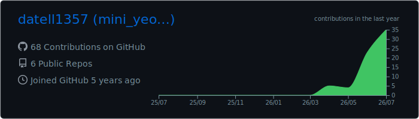
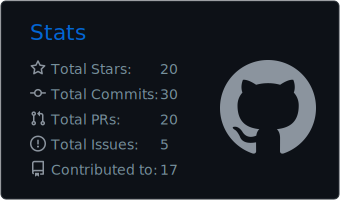
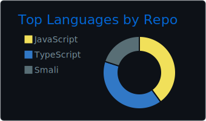
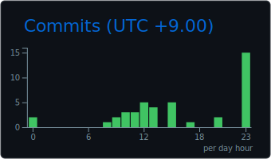
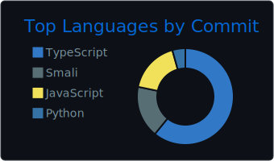

  

  

  

  
  

  
  

## Featured Projects

| Project | Description |
|---|---|
| [LazyCopy](https://github.com/datell1357/LazyCopy) | Send the active window or clipboard content into AI coding workflows. |
| [LazySwitch](https://github.com/datell1357/LazySwitch) | Monitor AI account usage and simplify account switching. |
| [AI Usage](https://github.com/datell1357/AI-Usage-for-Windows) | Track AI provider quotas from a Windows tray application. |

  Security · Automation · Developer Experience

